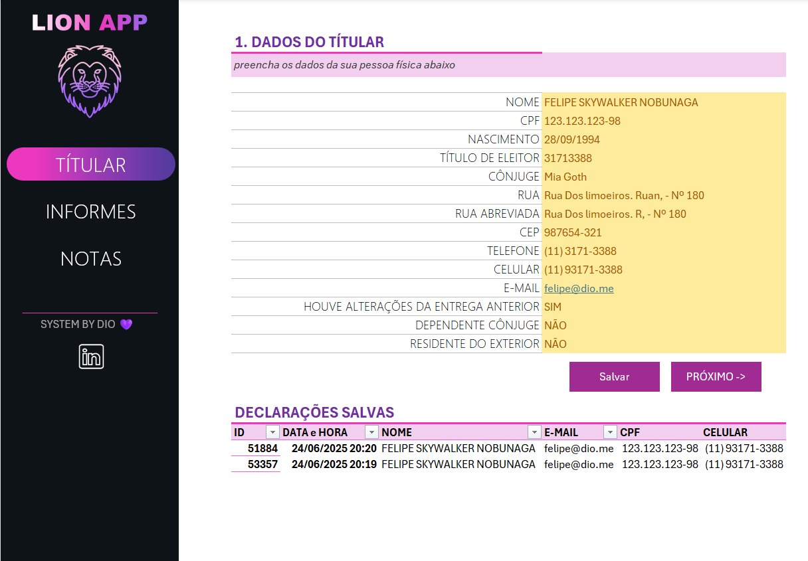
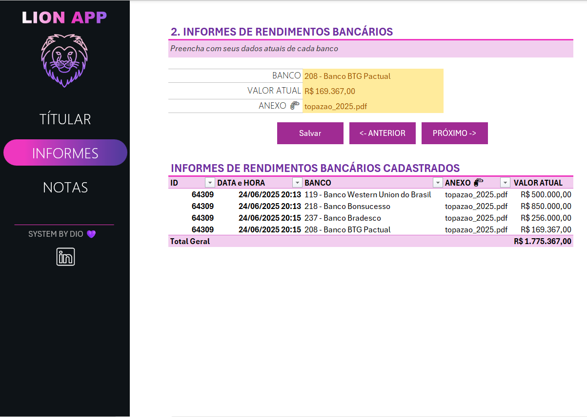
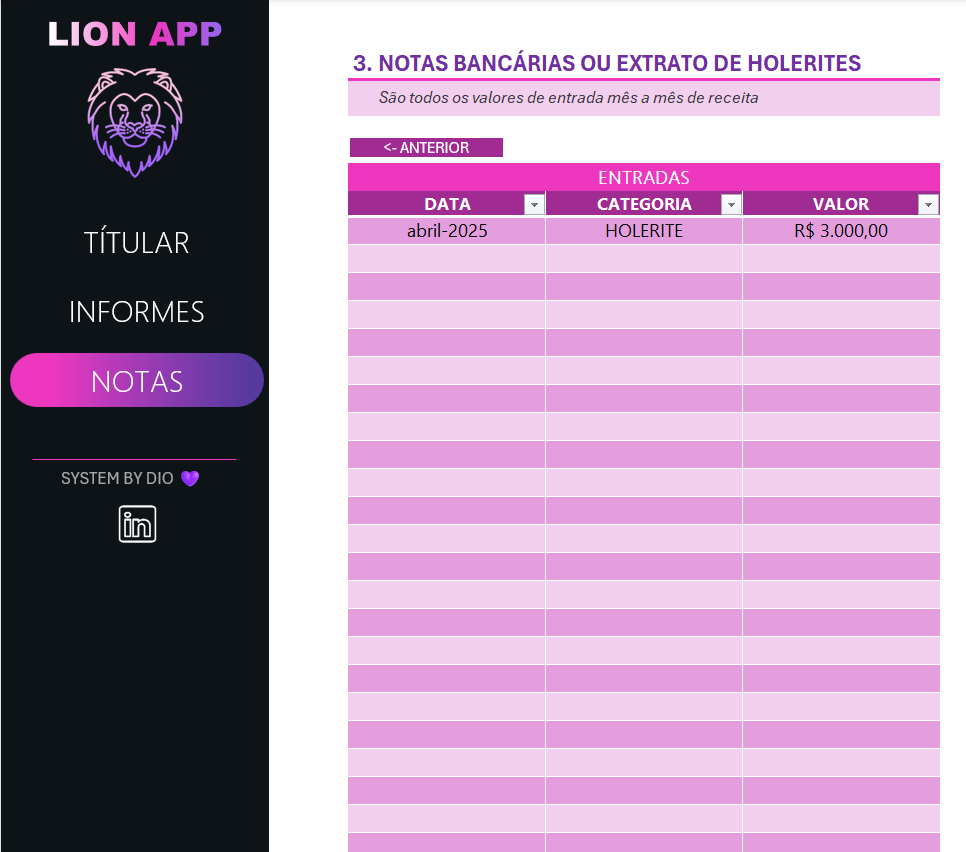

# 📊 Ferramenta Excel para Declaração de Imposto de Renda

## 📝 Descrição do Projeto

Este projeto tem como objetivo criar uma ferramenta no Excel que ajude a **organizar e reunir informações essenciais para a declaração de Imposto de Renda**.  

A proposta é construir um **agregador de dados** no qual o usuário possa controlar suas entradas de maneira eficiente e validada. A solução conta com:

- Menus de navegação interativos;
- Validações automáticas de campos;
- Funcionalidades extras como links rápidos;
- Interface amigável e prática;
- Totalmente construída no **Microsoft Excel com VBA**.

---

## 🚀 Funcionalidades

- ✅ Cadastro dos dados pessoais;
- ✅ Cadastro dos informes;
- ✅ Cadastro de notas;

---

## 🖼️ Demonstrações

### 📌 Tela Inicial

### 📌 Cadastro de Rendimentos

### 📌 Cadastro de notas

---

## 🧠 Tecnologias Utilizadas

- Excel (.xlsm)
- VBA (Visual Basic for Applications)
- Validações de dados
- Fórmulas e funções do Excel

---

## 📁 Estrutura do Arquivo

- `projeto_completo.xlsm`: Arquivo principal da ferramenta com todas as funcionalidades e macros.

---

## ✅ Como Usar

1. Baixe o arquivo `projeto_completo.xlsm`;
2. Habilite macros ao abrir o Excel;
3. Navegue pelo menu principal e preencha os dados conforme necessário;
4. Utilize os botões e validações para facilitar o preenchimento e garantir consistência das informações.

---

## 📌 Observações

- A ferramenta foi desenvolvida com foco no uso pessoal e controle de informações fiscais;
- É recomendável manter cópias de segurança antes de alterações relevantes;
- Nenhum dado é transmitido ou compartilhado externamente — 100% offline.

---

## 👨‍💻 Autor

Desenvolvido por Fellipe Lima.

---
