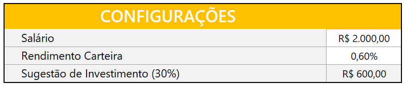
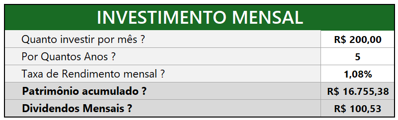
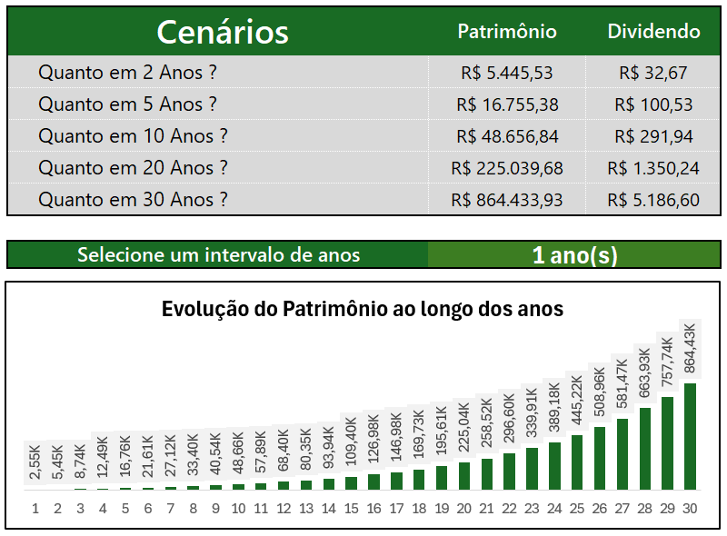

# 📊 App de Investimentos em Fundos Imobiliários

Este projeto foi desenvolvido com o objetivo de simular e analisar investimentos em Fundos de Investimento Imobiliário (FIIs), utilizando **Excel** como ferramenta principal. A planilha permite ao usuário simular aportes mensais, acompanhar rendimentos e analisar o retorno sobre o investimento ao longo do tempo.

---

## 🚀 Funcionalidades

- Simulação de aportes mensais ao longo de um período definido.
- Cálculo automático do patrimônio e dos proventos mensais.
- Gráficos de evolução do patrimônio ao longo dos anos.
- Simulação de investimento de acordo com o perfil e o tipo de FII.

---

## 🧩 Estrutura do Projeto

O arquivo Excel está dividido em diferentes abas com funções específicas:

- **Simulação:** Interface para escolha do valor investido, período e a taxa.
- **Resultados:** Exibição dos resultados acumulados da simulação..
- **Tabelas Auxiliares:** Cálculos e referências para suporte às fórmulas.

---

## 🖼️ Imagens do Projeto

### 📌 Configuração inicial (Sálario e rendiomento da carteira)

### 📈 DInvestimento mensal (Quanto quer investir por mês?, Por quantos anos? e Taxa de rendimento mensal?)

### 📈 DInvestimento mensal (Quanto quer investir por mês?, Por quantos anos? e Taxa de rendimento mensal?)

### 📈 DInvestimento mensal (Quanto quer investir por mês?, Por quantos anos? e Taxa de rendimento mensal?)

---

## 🛠️ Tecnologias Utilizadas

- Microsoft Excel
- Fórmulas: `SE`, `DESLOC`, `CONT.NÚM`, `PROCV`, `OU`, `VF`, entre outras
- Tabelas
- Gráficos

---

## 🧠 Lições Aprendidas

- Aplicação prática de fórmulas avançadas no Excel.
- Estruturação de simulações financeiras.
- Visualização de dados e storytelling com dashboards.

---
