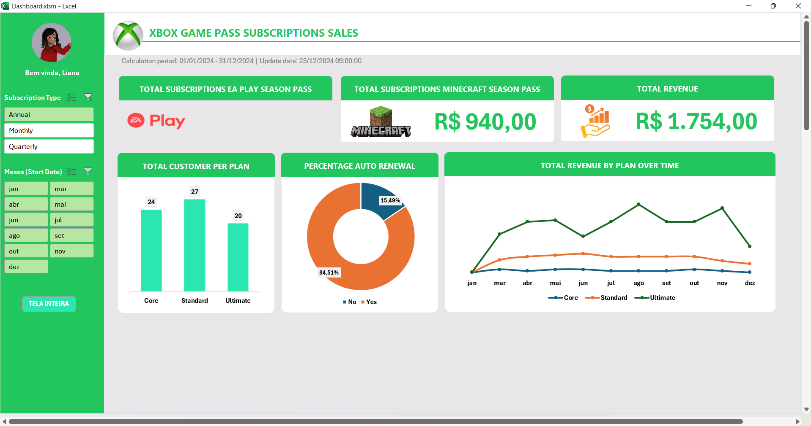
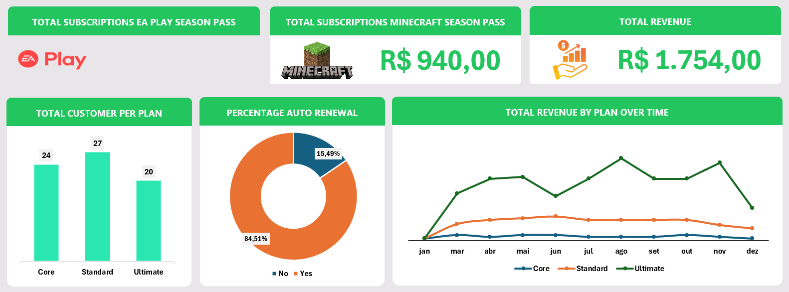

# 📊 Dashboard de Assinaturas - Xbox Plans

## 📁 Visão Geral do Projeto

Este projeto tem como objetivo a criação de um **Dashboard Interativo no Excel** para análise de planos de assinatura de usuários, com foco em métricas de adesão, receita e benefícios extras (como EA Play e Minecraft Pass). O dashboard foi desenvolvido com recursos visuais otimizados e macros VBA que ativam automaticamente o modo de apresentação ao abrir o arquivo.



---

## 📄 Dados Utilizados

A base principal do projeto está na planilha `B̳ases`, que contém informações detalhadas dos assinantes. Os dados incluem:

- **Subscriber ID**: Identificador único de cada assinante  
- **Name**: Nome do assinante  
- **Plan**: Tipo de plano
- **Start Date**: Data de início  
- **Auto Renewal**: Indica se a renovação automática está ativada  
- **Subscription Type**: Periodicidade da assinatura (Mensal, Anual, etc.)  
- **Subscription Price**: Valor base da assinatura  
- **EA Play e Minecraft Pass**: Indicam se o usuário possui os benefícios extras  
- **Coupon Value**: Valor de descontos aplicados  
- **Total Value**: Valor total da assinatura após benefícios e descontos  

---

## 📊 Métricas e Insights Gerados

O dashboard oferece uma visão consolidada das seguintes análises:

- Total de assinaturas EA PLAY SEASON PASS  
- Total de assinaturas MINECRAFT SEASON PASS  
- Total de Receita  
- Total de clientes por tipo de plano 
- Porcentagem de renovação automática  
- Evolução temporal das assinaturas  



---

## 🛠️ Funcionalidades Especiais (VBA)

O arquivo conta com uma macro que:

- Ativa o modo de **tela cheia** automaticamente ao abrir  
- Esconde barra de fórmulas, cabeçalhos e abas, proporcionando uma experiência imersiva  
- Possui um botão que alterna entre o modo "normal" e "apresentação"


```vba
Sub AlternarModoApresentacao()
    Static ModoApresentacaoAtivo As Boolean

    If Not ModoApresentacaoAtivo Then
        Application.DisplayFullScreen = True
        ActiveWindow.DisplayHeadings = False
        Application.DisplayFormulaBar = False
        Application.ExecuteExcel4Macro "SHOW.TOOLBAR(\"Ribbon\", False)"
        ActiveWindow.DisplayWorkbookTabs = False
        ModoApresentacaoAtivo = True
    Else
        Application.DisplayFullScreen = False
        ActiveWindow.DisplayHeadings = True
        Application.DisplayFormulaBar = True
        Application.ExecuteExcel4Macro "SHOW.TOOLBAR(\"Ribbon\", True)"
        ActiveWindow.DisplayWorkbookTabs = True
        ModoApresentacaoAtivo = False
    End If
End Sub
```

---

## ▶️ Como Executar

    1. Abra o arquivo Dashboard.xlsm no Excel com suporte a macros habilitado.

    2. Ao abrir, o modo de apresentação será ativado automaticamente.

    3. Use o botão na interface (caso inserido) para alternar entre os modos.

    4. Navegue pela aba Dashboard para visualizar os gráficos e indicadores.

---

## 💡 Requisitos

    1. Microsoft Excel (versão com suporte a macros, preferencialmente 2016 ou superior)

    2. Macros habilitadas no momento da abertura (.xlsm)
