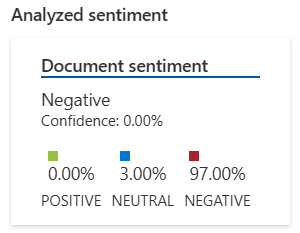
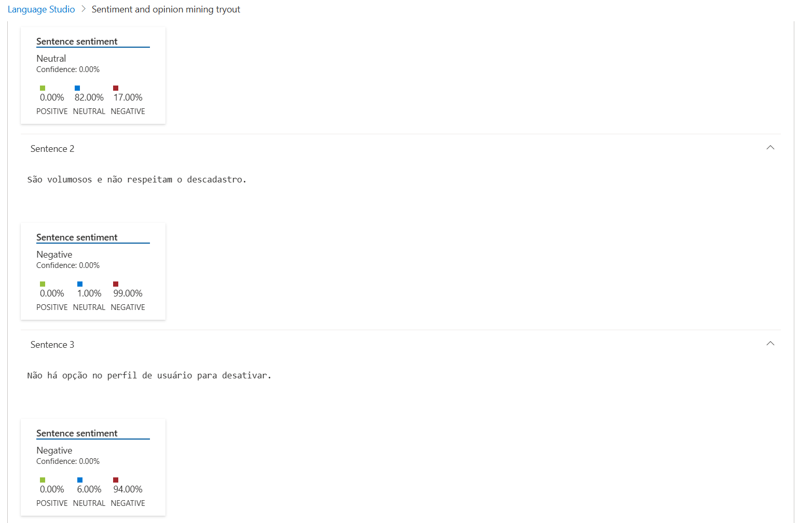

# Language Studio - Anotações de Prática

## Teste Realizado: Análise de Sentimento e Opinião

**Texto analisado:**
> "Já cliquei no botão de descadastro diversas vezes no e-mail e não paro de receber e-mails de marketing. São volumosos e não respeitam o descadastro. Não há opção no perfil de usuário para desativar."

**Resultado da análise:**
- Sentimento geral do documento: **Negativo**
- Confiança:
  - Positivo: 0.00
  - Neutro: 0.03
  - Negativo: 0.97

**Sentenças analisadas individualmente:**
1. "Já cliquei no botão de descadastro diversas vezes no e-mail e não paro de receber e-mails de marketing."
   - Sentimento: Neutro
   - Confiança: Neutro 0.82

2. "São volumosos e não respeitam o descadastro."
   - Sentimento: Negativo
   - Confiança: Negativo 0.99

3. "Não há opção no perfil de usuário para desativar."
   - Sentimento: Negativo
   - Confiança: Negativo 0.94

## Insights
- A ferramenta é capaz de identificar nuances de sentimento por sentença.
- Frases com crítica direta ou termos negativos claros tendem a ser classificadas com alta confiança como negativas.
- Mesmo quando há reclamação indireta (como "não paro de receber"), a ferramenta pode reconhecer como neutra se o tom for menos enfático.
- Útil para análises automatizadas de feedback de clientes, SAC, redes sociais, etc.
- Relevante para implementar ações baseadas em sentimento, como alertas ou priorização de atendimento.

*Modelo utilizado: versão 2025-01-01.*
