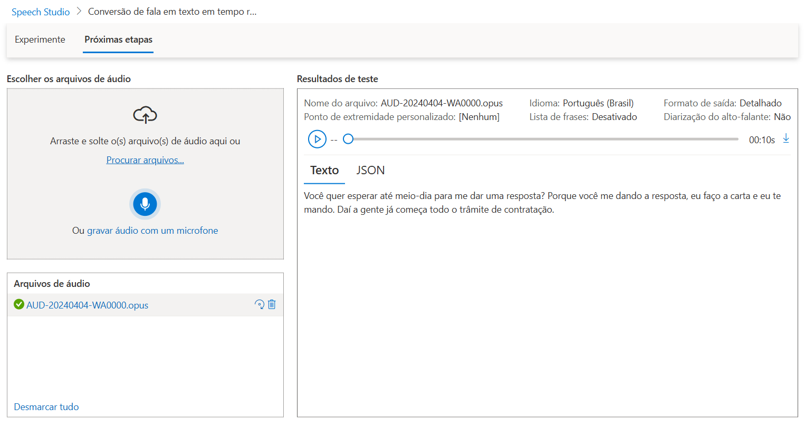

# Speech Studio - Anotações de Prática

## Testes Realizados

### 1. Reconhecimento de Fala (Speech-to-Text)

# Insights do Reconhecimento de Fala - Exemplo Prático

Este documento apresenta os principais insights obtidos a partir do exemplo real de reconhecimento de fala usando o Azure Speech Studio com um arquivo de áudio no formato `.opus`.

## 1. Precisão do Reconhecimento

- O modelo apresentou uma confiança (confidence) média em torno de 0.86, indicando boa precisão para um áudio natural, com possíveis ruídos e variações de fala.
- Isso demonstra que a tecnologia é robusta para aplicações práticas, embora não seja infalível.

## 2. Detalhamento Temporal da Transcrição

- Cada palavra reconhecida possui dados de tempo de início (offset) e duração, permitindo sincronização precisa entre áudio e texto.
- Essa granularidade viabiliza aplicações como legendas automáticas, análise detalhada de discurso e monitoramento em tempo real.

## 3. Pontuação e Legibilidade

- O campo `DisplayText` apresenta a transcrição já pontuada, mesmo que a entrada bruta do JSON não contenha pontuação explícita.
- Isso melhora significativamente a legibilidade e usabilidade do texto gerado.

## 4. Capacidade de Processar Frases Naturais

- A frase transcrita possui estruturas complexas e naturais, indicando que o modelo suporta bem a fala cotidiana, sem limitações rígidas de vocabulário ou formato.

## 5. Suporte a Formatos de Áudio Comuns

- A utilização de um arquivo `.opus` mostra que o serviço é compatível com formatos populares de áudio, facilitando sua integração em sistemas de mensagens e gravação.

## 6. Aplicações Práticas Possíveis

- Transcrição de chamadas de atendimento ao cliente para controle de qualidade
- Geração automática de relatórios a partir de áudios gravados
- Criação de legendas para vídeos, podcasts e webinars
- Análise semântica de conteúdo falado para insights de negócios

## 7. Limitações e Considerações

- A precisão não é perfeita, o que pode requerer revisão humana em contextos sensíveis.
- A qualidade do áudio, sotaques regionais e ruídos ambientais impactam diretamente o desempenho.
- É importante planejar estratégias para tratamento de erros e validação de resultados.

---

Esses insights ajudam a entender as capacidades e desafios da tecnologia de reconhecimento de fala do Azure, fornecendo bases para projetos e estudos futuros.

