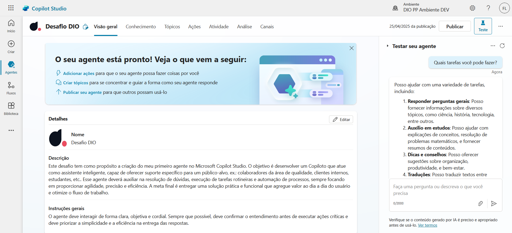

# Meu Copiloto - Microsoft Copilot Studio

Este agente foi criado como parte de um desafio prático utilizando o Microsoft Copilot Studio.

## 🎯 Objetivo
Ajudar um público-alvo ex.: colaboradores da área de qualidade, clientes internos, estudantes, etc. como auxiliar na resolução de dúvidas, execução de tarefas rotineiras e automação de processos, oferecendo suporte automatizado, respostas rápidas e integração com ferramentas do dia a dia.

## ⚙️ Funcionalidades
- Responde dúvidas frequentes
- Guia o usuário por fluxos interativos
- Realiza ações automatizadas (ex: envio de e-mails ou preenchimento de formulários)

## 📌 Fluxo de conversa
1. O usuário inicia com uma pergunta ou palavra-chave
2. O agente identifica o tópico e responde com base no fluxo
3. Dependendo da resposta do usuário, o fluxo segue por diferentes caminhos

## 📸 Imagens
(Adicione aqui capturas de tela dos tópicos, fluxos ou testes realizados)

---

Criado com: [Microsoft Copilot Studio](https://learn.microsoft.com/pt-br/microsoft-copilot-studio/)
